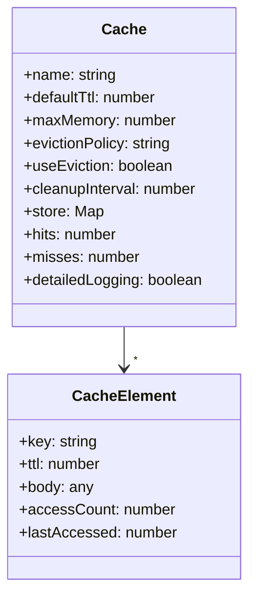

### ✅ **Design**

We have a class called `Cache`.

#### It includes the following attributes:

* `name`: Assigns a name to the cache.
* `defaultTtl`: If no TTL is set when adding an element to the cache, this default value is used. It can be null.
* `maxMemory`: Defines the maximum amount of memory (in megabytes) the cache can use.
* `evictionPolicy`: Currently supports only the LRU (Least Recently Used) strategy.
* `useEviction`: A boolean flag that determines whether to apply an eviction policy or to reject new elements when memory is full.
* `cleanupInterval`: Time in milliseconds that determines how often the internal cleaner method should run to remove expired elements.
* `store`: A structure that holds `CacheElement` objects.
* `hits` and `misses`: Integer counters to track how many times elements were successfully or unsuccessfully retrieved.
* `detailedLogging`: A boolean (default is `false`). When enabled, it tracks how many times each key has been accessed and the timestamp of the last access.

---

We also have a class called `CacheElement`.

#### Its attributes are:

* `key`: A unique identifier.
* `ttl`: Optional. Time to live for this element.
* `body`: The content stored in the cache.
* If `detailedLogging` is enabled, it also stores:

  * `accessCount`: Number of times the element has been accessed.
  * `lastAccessed`: Timestamp of the last access.

---

There is a cleaner method inside `Cache` that runs at regular intervals (defined by `cleanupInterval`) to remove elements whose TTL has expired.

When calling the `get` method, we first check if the request headers include `Cache-Control: max-age=0`, or if a `skipCache` flag (default: false) is passed to the method. This allows compatibility with non-HTTP APIs.

In the future, we may move this library to a Docker-based REST API, allowing users to deploy it on an EC2 instance.

The user is responsible for checking if the returned value is `null`, and for setting new values into the cache as needed.

Later improvements to consider:

* Replacing the internal data structure with a `LinkedHashMap`-like model or a combination of a doubly linked list and map for true LRU performance at scale.
* Finding a more accurate way to estimate memory usage than `Buffer.byteLength(JSON.stringify(value))`.

---

### 📊 **Mermaid Class Diagram**

